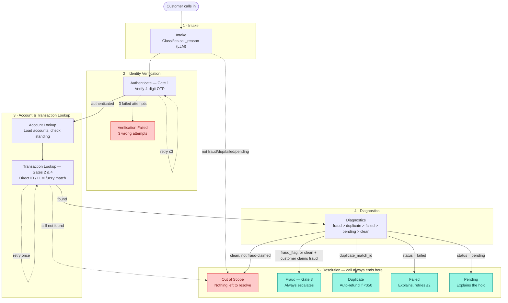

# Agentic Banking Support Agent

A LangGraph-based agentic customer support agent for banking, built as a portfolio
project to demonstrate production-grade agentic AI design: deterministic routing,
human-in-the-loop confirmation gates, auditable policy logic, and bounded escalation.

## Scope

Handles four call reasons through a shared identity/account/lookup/diagnostics
pipeline, then forks into resolution paths:

1. **Failed transaction** — explain the block reason, offer retry or escalation
2. **Suspected fraud** — always escalates to a human; optional card freeze with confirmation
3. **Duplicate charge** — auto-resolves only if amount < $50 and no similar dispute in the past year
4. **Stuck pending charge** — explain-only, no action tools

Diagnostic evidence overrides the customer's stated reason, in priority order:
fraud > duplicate > failed > pending > posted-with-no-issue.

## Architecture



Gates are the four points the graph pauses via `interrupt()` and waits for the
customer: **1** OTP verification, **2** transaction disambiguation, **3**
card-freeze confirmation, **4** lookup clarification. Teal = a resolution was
reached (even escalation counts); red = the call ends without one.

This diagram is maintained by hand for readability (phase grouping, gate
labels, color coding) — it can drift from the code if a node or edge changes
without updating it here too. The literal ground truth is always whatever
`build_graph()` actually compiles to; regenerate it any time with:

```bash
python3 -c "from graph.graph import build_graph; print(build_graph().get_graph().draw_mermaid())"
```

## Status

Build in progress, following this order:

- [x] 1. Mock data and read/action tools
- [x] 2. State schema in code
- [x] 3. Skeleton graph with stub nodes + router functions (unit-tested before any LLM)
- [x] 4. LLM added to intake, lookup matching, customer-facing explanations
  - [x] intake — done (graph/llm.py:classify_intake, forced tool-use for structured call_reason)
  - [x] lookup matching — done (graph/llm.py:match_transaction, direct ID + LLM fuzzy matching)
  - [x] resolution explanations — done (four specialized explain functions with dynamic guidance injection)
- [x] 5. Interrupts + checkpointer for OTP, clarifications, action confirmations
  - [x] Gate 1: OTP authentication interrupt with attempt countdown
  - [x] Gate 2: Transaction disambiguation interrupt with index/ID resolution
  - [x] Gate 3: Card freeze action confirmation interrupt in suspected fraud
  - [x] Gate 4: Lookup clarification interrupt when no transaction matches
- [x] 6. Evaluation suite (scripted scenarios + simulated customer) — `eval/`, run with `python3 -m eval.run_eval`
- [~] 7. Polish: tracing, UI, architecture diagram, eval results
  - [x] UI — `ui/app.py`, a Streamlit chat interface against the real compiled graph
  - [x] Tracing — LangSmith, see "Tracing" below
  - [x] Architecture diagram — see "Architecture" above
  - [ ] Eval-results writeup

## Project structure

```
banking-support-agent/
  data/
    generate_mock_data.py   # generates the four JSON tables below
    customers.json
    accounts.json
    transactions.json
    diagnostics.json
  graph/
    state.py                # AgentState TypedDict — the full shared state schema
    config.py               # policy constants (thresholds, retry caps, LLM provider config)
    nodes.py                # node functions + router functions (no langgraph dependency)
    graph.py                # StateGraph assembly — wires nodes.py into an actual graph
    llm.py                  # multi-provider LLM wrapper (Anthropic & OpenAI-compatible open-source)
  tests/
    test_routers.py         # unit tests for the three router functions
    test_intake_node.py     # unit tests for intake_node (mocks the LLM call)
    test_lookup_node.py     # unit tests for transaction_lookup_node (mocks the LLM call)
    test_resolution_nodes.py # unit tests for resolution nodes (policy logic + mock LLM)
    test_data_nodes.py      # unit tests for data-reading nodes (auth, accounts, diagnostics)
  eval/
    scenarios.py            # scenario definitions (4 scripted + 1 simulated-customer)
    simulated_customer.py   # LLM plays the customer for the fraud scenario
    judge.py                # LLM-as-judge: grades explanations against facts + guardrail rules
    runner.py                # drives one scenario through the real compiled graph
    run_eval.py              # entry point — runs every scenario, writes eval/reports/latest.md
  ui/
    app.py                   # Streamlit chat interface — talk to the real compiled graph
```

## Running it for real

`graph/llm.py` reads its provider config from `graph/config.py`, which reads
environment variables (or a git-ignored `.env` in the repo root):

```
LLM_PROVIDER=anthropic
LLM_API_KEY=sk-ant-...
```

or, for a free OpenAI-compatible backend like Groq (what this project's own
`.env` uses for testing):

```
LLM_PROVIDER=openai_compatible
LLM_BASE_URL=https://api.groq.com/openai/v1
LLM_MODEL=openai/gpt-oss-120b
LLM_API_KEY=gsk_...
```

Router and node-logic tests (`tests/`) don't need this — they mock the LLM
call and run instantly. The eval suite (`eval/`) and any real end-to-end run
of the compiled graph do need it, since they make live LLM calls.

```
python3 -m eval.run_eval
```

## Trying it interactively

```
streamlit run ui/app.py
```

Pick who you're calling as from the sidebar, then chat — it talks to the real
compiled graph (real LLM calls, real interrupt/resume gates for OTP,
disambiguation, and card-freeze confirmation), not a scripted demo. The
sidebar's "Case details" panel shows what the agent actually decided
(resolution, escalation, card-freeze outcome, tool audit log) after each call.

## Tracing

[LangSmith](https://smith.langchain.com) gives a visual, node-by-node trace of
every graph run — every node, every LLM call (full prompt + response, tokens,
latency), and where each interrupt paused/resumed — without any new logging
code. It's separate from `tool_audit_log` (which only records the specific
entries this project's own nodes choose to log, e.g. `customers_lookup`); it
captures the whole trace automatically.

Enable it by adding to `.env`:

```
LANGSMITH_TRACING=true
LANGSMITH_API_KEY=lsv2_...
LANGSMITH_PROJECT=banking-support-agent
```

No code changes needed — `build_graph()` picks it up automatically once these
are set, for any script that loads `.env` (`ui/app.py`, `eval/run_eval.py`, or
your own). Runs show up at smith.langchain.com under **Tracing** →
`banking-support-agent`. LangSmith has a free tier for individual use;
check current limits at smith.langchain.com before relying on it further.

## Design notes

Routing is deterministic Python, not LLM judgment — the LLM handles language,
Python handles policy. This keeps decisions auditable, unit-testable, and
resistant to prompt injection. Full design rationale, state schema, and node
design live alongside this repo in the project's design docs.
